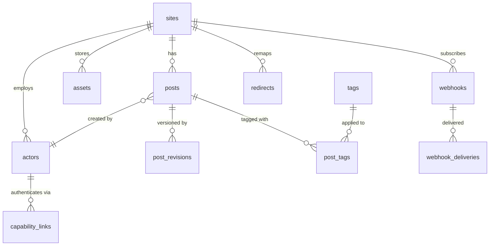

# Data Model

This document describes the PostgreSQL schema for AgentCMS.  All tables are
defined as SQLAlchemy ORM models in `app/models/` and managed by Alembic
migrations in `alembic/versions/`.

## ER Diagram

## Tables

### `sites`

Content container.  Every post belongs to exactly one site.

| Column | Type | Constraints | Notes |
|--------|------|-------------|-------|
| `id` | `uuid` | PK | |
| `slug` | `varchar(128)` | UNIQUE, NOT NULL, indexed | e.g. `blog` |
| `name` | `varchar(256)` | NOT NULL | Human-readable name |
| `base_url` | `text` | NULLABLE | Public URL of the site |
| `publish_mode` | `varchar(20)` | NOT NULL, default `auto` | `auto` or `require_review` |
| `settings` | `jsonb` | NULLABLE, default `{}` | Arbitrary site config |
| `created_at` | `datetime` | NOT NULL, default `now()` | |
| `updated_at` | `datetime` | NOT NULL, default `now()` | |

### `posts`

Agent-friendly posts with slug stability and immutable revisions.

| Column | Type | Constraints | Notes |
|--------|------|-------------|-------|
| `id` | `uuid` | PK | |
| `site_id` | `uuid` | NOT NULL, FK → `sites.id` | |
| `slug` | `varchar(256)` | NOT NULL, UNIQUE per site | `UNIQUE (site_id, slug)` |
| `title` | `varchar(512)` | NOT NULL, default `""` | |
| `body_md` | `text` | NOT NULL, default `""` | Markdown body |
| `excerpt` | `text` | NULLABLE | |
| `status` | `varchar(20)` | NOT NULL, default `draft`, indexed | `draft` / `pending_review` / `published` / `archived` / `trashed` |
| `frontmatter` | `jsonb` | NULLABLE, default `{}` | |
| `author_label` | `varchar(256)` | NULLABLE | |
| `created_by_actor_id` | `uuid` | NULLABLE | |
| `created_at` | `datetime` | NOT NULL, default `now()` | |
| `updated_at` | `datetime` | NOT NULL, default `now()` | |
| `published_at` | `datetime` | NULLABLE | |
| `unpublish_at` | `datetime` | NULLABLE | |
| `revision_count` | `integer` | NOT NULL, default `0` | |
| `content_hash` | `varchar(64)` | NULLABLE | |
| `deleted_at` | `datetime` | NULLABLE | Set on soft delete |
| `search_vector` | `tsvector` | NULLABLE | Full-text search vector (title A, tags B, excerpt C, body D) |

**Composite index:** `ix_posts_site_status_pub_id` on `(site_id, status, published_at DESC, id)`.
**GIN index:** `ix_posts_search_vector` on `(search_vector)` for full-text search.
**GIN index:** `ix_posts_title_trgm` on `(title gin_trgm_ops)` for fuzzy matching.
**Index:** `ix_posts_slug` on `(slug)` for fast slug lookups.

**Trigger:** `trg_posts_search_vector` fires on INSERT/UPDATE of title, body_md, excerpt to keep `search_vector` in sync.
**Trigger:** `trg_posts_search_vector_on_tags` fires on INSERT/DELETE/UPDATE of post_tags to keep `search_vector` in sync when tags change.

### `post_revisions`

Append-only snapshot.  Never updated, never deleted except by explicit
retention policy.

| Column | Type | Constraints | Notes |
|--------|------|-------------|-------|
| `id` | `uuid` | PK | |
| `post_id` | `uuid` | NOT NULL, FK → `posts.id` | |
| `revision` | `integer` | NOT NULL | Monotonically increasing |
| `title` | `varchar(512)` | NOT NULL, default `""` | |
| `body_md` | `text` | NOT NULL, default `""` | |
| `frontmatter` | `jsonb` | NULLABLE, default `{}` | |
| `status` | `varchar(20)` | NOT NULL, default `draft` | Status at this revision |
| `editor_label` | `varchar(256)` | NULLABLE | |
| `actor_id` | `uuid` | NULLABLE | |
| `request_id` | `varchar(64)` | NULLABLE | Correlates to audit trail |
| `created_at` | `datetime` | NOT NULL, default `now()` | |
| `diff_unified` | `text` | NULLABLE | Unified diff from previous |

### `tags`

Slug-normalised, lowercase tags.  Max 20 per post (enforced in application
code).

| Column | Type | Constraints | Notes |
|--------|------|-------------|-------|
| `id` | `uuid` | PK | |
| `slug` | `varchar(128)` | UNIQUE, NOT NULL, indexed | Lowercase, normalised |
| `name` | `varchar(128)` | NOT NULL | Display name |
| `created_at` | `datetime` | NOT NULL, default `now()` | |

### `post_tags`

Join table for the many-to-many relationship between posts and tags.

| Column | Type | Constraints | Notes |
|--------|------|-------------|-------|
| `post_id` | `uuid` | PK, FK → `posts.id` ON DELETE CASCADE | |
| `tag_id` | `uuid` | PK, FK → `tags.id` ON DELETE CASCADE | |
| `created_at` | `datetime` | NOT NULL, default `now()` | |

### `actors`

The single attribution table for anything that writes: humans (dashboard
users) and machines (tokens, capability links).

| Column | Type | Constraints | Notes |
|--------|------|-------------|-------|
| `id` | `uuid` | PK | |
| `kind` | `varchar(20)` | NOT NULL, default `human` | `human` or `machine` |
| `label` | `varchar(256)` | NOT NULL | |
| `site_id` | `uuid` | NULLABLE | |
| `scopes` | `jsonb` | NULLABLE, default `[]` | |
| `expires_at` | `datetime` | NULLABLE | |
| `revoked_at` | `datetime` | NULLABLE | |
| `last_used_at` | `datetime` | NULLABLE | |
| `last_used_ip` | `varchar(45)` | NULLABLE | IPv4 or IPv6 |
| `uses_count` | `integer` | NOT NULL, default `0` | |
| `created_at` | `datetime` | NOT NULL, default `now()` | |

### `capability_links`

Scoped, time-limited tokens for agent access.  The token itself is never
stored -- only a SHA-256 hash.

| Column | Type | Constraints | Notes |
|--------|------|-------------|-------|
| `id` | `uuid` | PK | |
| `actor_id` | `uuid` | NOT NULL, indexed | |
| `token_hash` | `varchar(64)` | UNIQUE, NOT NULL, indexed | SHA-256 of the raw token |
| `path_scope` | `varchar(512)` | NOT NULL, default `/` | |
| `verbs` | `jsonb` | NULLABLE, default `["GET"]` | |
| `expires_at` | `datetime` | NULLABLE | |
| `uses_remaining` | `integer` | NULLABLE | |
| `revoked_at` | `datetime` | NULLABLE | |
| `created_at` | `datetime` | NOT NULL, default `now()` | |

### `idempotency_keys`

Stores the response for a given idempotency key so that retries return the
same result.  24-hour retention is enforced by the application.

| Column | Type | Constraints | Notes |
|--------|------|-------------|-------|
| `key` | `varchar(256)` | PK | The idempotency key |
| `actor_id` | `uuid` | NULLABLE | |
| `request_fingerprint` | `varchar(128)` | NULLABLE | |
| `response_status` | `integer` | NULLABLE | HTTP status of the original response |
| `response_body` | `jsonb` | NULLABLE | |
| `created_at` | `datetime` | NOT NULL, default `now()` | |

### `audit_events`

Append-only audit trail.

| Column | Type | Constraints | Notes |
|--------|------|-------------|-------|
| `id` | `uuid` | PK | |
| `actor_id` | `uuid` | NULLABLE, indexed | |
| `actor_label` | `varchar(256)` | NULLABLE | Snapshot at time of event |
| `action` | `varchar(128)` | NOT NULL | e.g. `post.create` |
| `target_type` | `varchar(64)` | NULLABLE | e.g. `post` |
| `target_id` | `varchar(128)` | NULLABLE | |
| `before_hash` | `varchar(64)` | NULLABLE | Content hash before |
| `after_hash` | `varchar(64)` | NULLABLE | Content hash after |
| `request_id` | `varchar(64)` | NULLABLE | |
| `ip` | `varchar(45)` | NULLABLE | |
| `user_agent` | `text` | NULLABLE | |
| `source` | `varchar(20)` | NOT NULL, default `api` | `api` / `link` / `dashboard` / `mcp` |
| `created_at` | `datetime` | NOT NULL, default `now()` | |

### `assets`

Uploaded media files.

| Column | Type | Constraints | Notes |
|--------|------|-------------|-------|
| `id` | `uuid` | PK | |
| `site_id` | `uuid` | NULLABLE, indexed | |
| `filename` | `varchar(512)` | NOT NULL | |
| `content_type` | `varchar(128)` | NULLABLE | |
| `byte_size` | `bigint` | NULLABLE | |
| `storage_key` | `varchar(1024)` | NOT NULL | S3 key or local path |
| `alt_text` | `text` | NULLABLE | |
| `kind` | `varchar(20)` | NOT NULL, default `file` | `image` or `file` |
| `sha256` | `varchar(64)` | NULLABLE, indexed | SHA-256 of the file content |
| `width` | `integer` | NULLABLE | Image width in pixels |
| `height` | `integer` | NULLABLE | Image height in pixels |
| `variant_paths` | `jsonb` | NULLABLE, default `{}` | Paths to generated variants |
| `status` | `varchar(20)` | NOT NULL, default `pending` | `pending`, `ready`, `failed` |
| `magic_content_type` | `varchar(128)` | NULLABLE | Detected content type from magic bytes |
| `deleted_at` | `datetime` | NULLABLE | Set on soft delete |
| `created_by_actor_id` | `uuid` | NULLABLE | |
| `created_at` | `datetime` | NOT NULL, default `now()` | |

### `webhooks`

External system subscriptions.

| Column | Type | Constraints | Notes |
|--------|------|-------------|-------|
| `id` | `uuid` | PK | |
| `site_id` | `uuid` | NULLABLE, indexed | |
| `url` | `text` | NOT NULL | |
| `secret` | `varchar(256)` | NULLABLE | HMAC signing secret |
| `events` | `jsonb` | NULLABLE, default `[]` | |
| `active` | `boolean` | NOT NULL, default `true` | |
| `created_at` | `datetime` | NOT NULL, default `now()` | |

### `webhook_deliveries`

Delivery attempts for webhooks.

| Column | Type | Constraints | Notes |
|--------|------|-------------|-------|
| `id` | `uuid` | PK | |
| `webhook_id` | `uuid` | NOT NULL, indexed | FK → `webhooks.id` |
| `event` | `varchar(128)` | NOT NULL | |
| `payload` | `jsonb` | NULLABLE | |
| `response_status` | `integer` | NULLABLE | |
| `response_body` | `text` | NULLABLE | |
| `delivered_at` | `datetime` | NULLABLE | |
| `created_at` | `datetime` | NOT NULL, default `now()` | |

### `redirects`

Old slug → new slug mappings for 301 redirects.

| Column | Type | Constraints | Notes |
|--------|------|-------------|-------|
| `id` | `uuid` | PK | |
| `site_id` | `uuid` | NOT NULL, indexed | |
| `old_slug` | `varchar(256)` | NOT NULL | |
| `new_slug` | `varchar(256)` | NOT NULL | |
| `status_code` | `integer` | NOT NULL, default `301` | |
| `created_at` | `datetime` | NOT NULL, default `now()` | |

**Unique constraint:** `UNIQUE (site_id, old_slug)`.

## Design Decisions

### Slug Stability

Agents invent slugs and retry.  Colliding writes must not clobber each other.
The `UNIQUE (site_id, slug)` constraint at the database level guarantees this:
a second write with the same slug raises an `IntegrityError` that the API
layer translates into a `409 Conflict` with a `suggested_slug` extension.

### Immutable Revisions

`post_revisions` is append-only: never updated, never deleted except by
explicit retention policy.  This is what makes "undo" safe for an unsupervised
actor -- the previous state is always recoverable.

### Soft Delete

Deleting a post sets `status = 'trashed'` and `deleted_at = now()`.  The row
and all its revisions are never physically removed.  Queries filter on
`deleted_at IS NULL` to exclude trashed posts.
